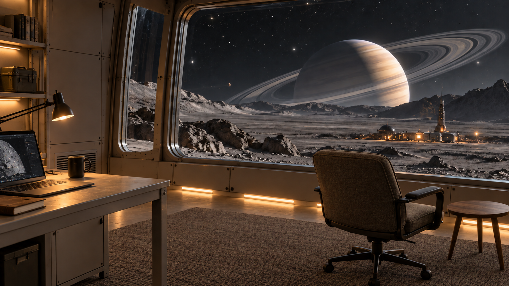

# Ambient Colony

Sci-fi soundscapes for sleep, focus and study. Creative media project for [Ambient Colony on YouTube](https://www.youtube.com/@ambientcolony).

## Start here

- [AGENTS.md](AGENTS.md): current working instructions and reusable animation workflow.
- [PROJECT.md](PROJECT.md): creative decisions and project context.
- [Concept gallery](creative/concepts/README.md): nine saved initial concepts.
- [Animation workflow](creative/ANIMATION_WORKFLOW.md): production stages and review gates.
- [Next experiment prompt](creative/ringfall/animation/next-planet-pass-prompt.md): isolated planetary atmosphere generation and compositing.
- [Local AI test findings](creative/ringfall/animation/wan-tests/README.md): timings, failures and reproducible settings.
- [Historical learning log](creative/history/animation-learning-log-2026-09-24.md): earlier prompts and experiments, superseded by AGENTS.md where they conflict.

## Current selected image

Ringfall is the selected scene. No animation is approved as a final. Hand-composited versions were too subtle; two local Wan tests produced more movement but distorted the scene. The next experiment isolates atmospheric motion and composites it into the original.

## Storage

Track source 2D concepts, refinements, prompts, scripts, masks, settings and review reports. `.local/` contains the local ComfyUI runtime and approximately 18 GB of model weights and is excluded from Git. Experimental MP4/MOV/WebM outputs remain local; reports retain their filenames. Video links in historical reports may therefore only work in the local workspace. Music and final large-media storage still need a separate decision; no music has been produced here yet.

Local tools are the default. No paid video services, API calls or separate generation credits.
