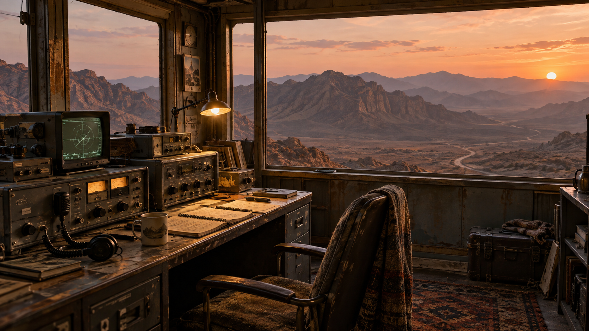
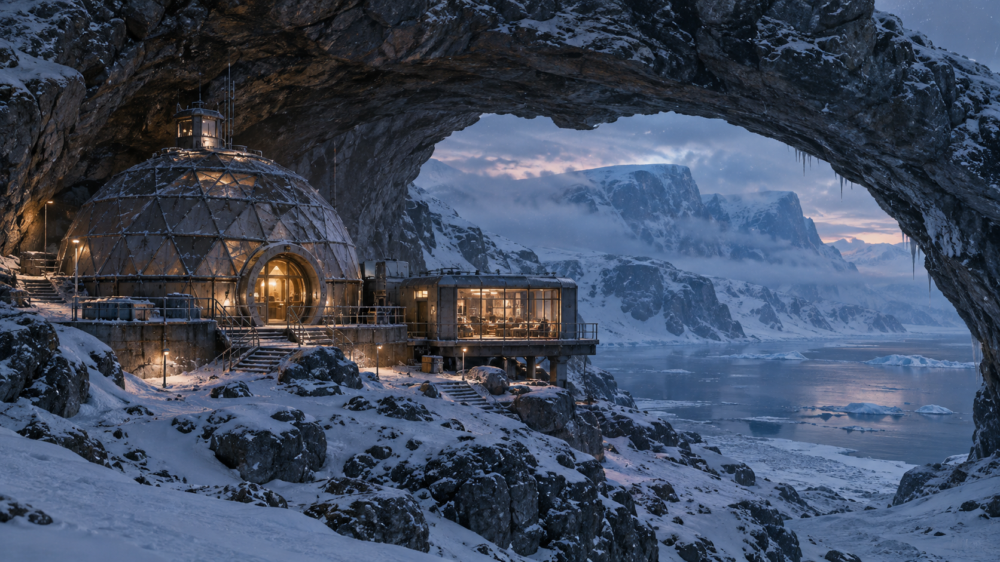
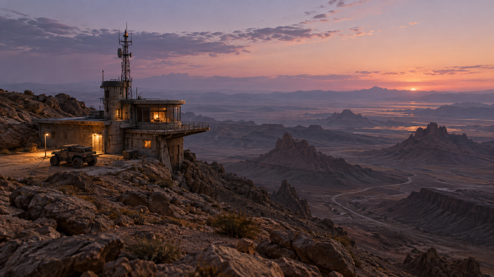
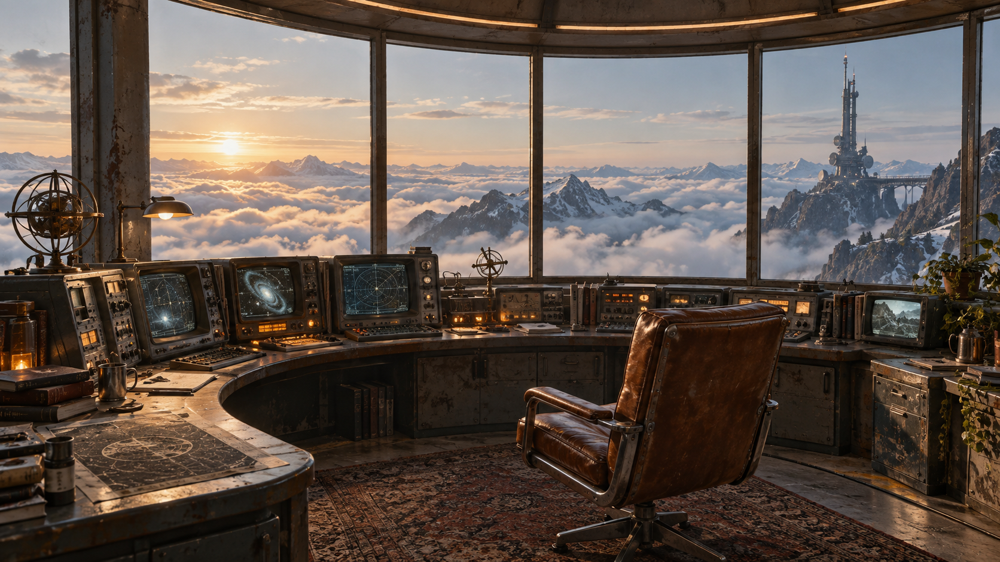
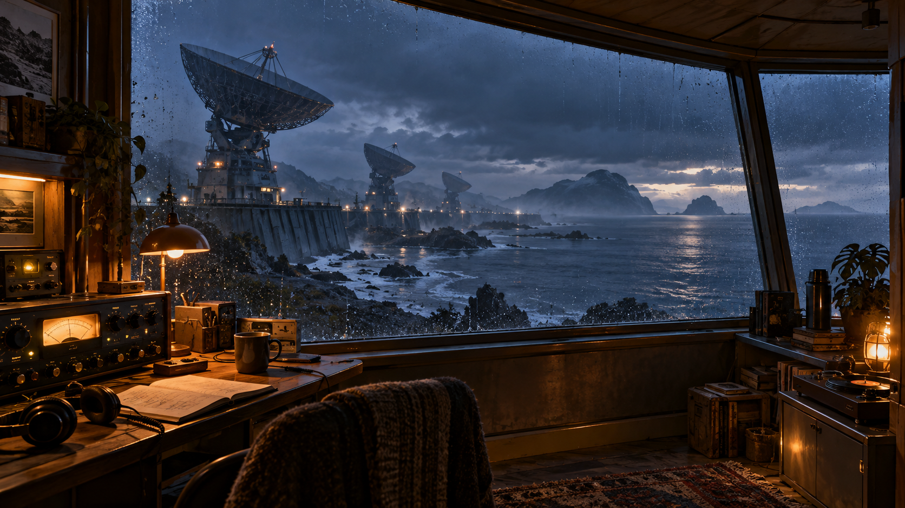
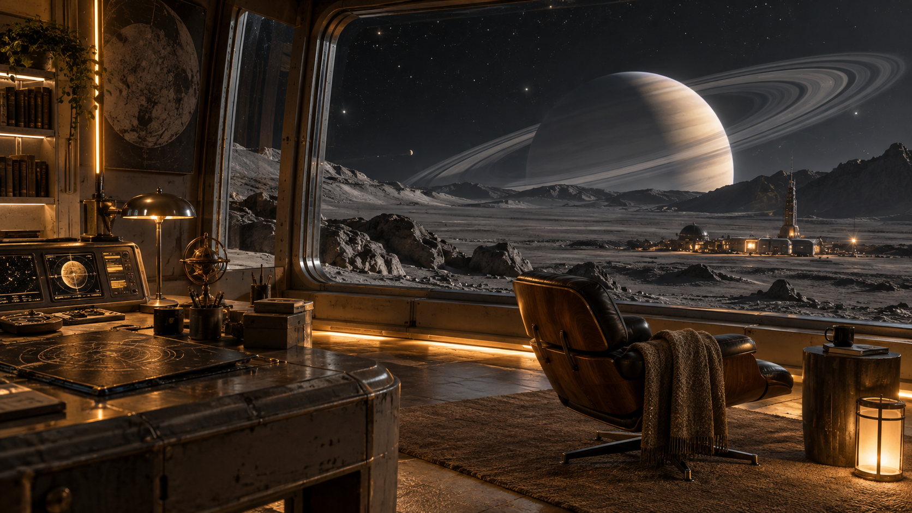
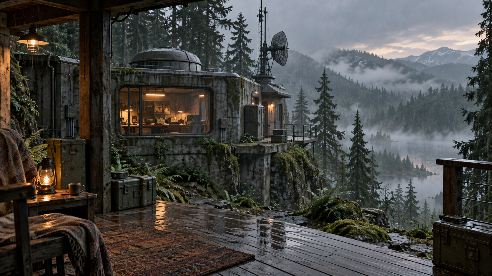
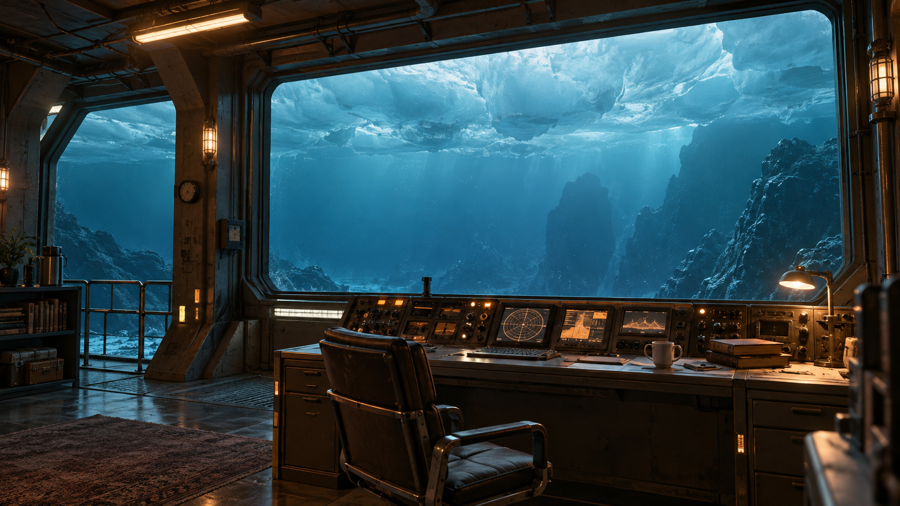
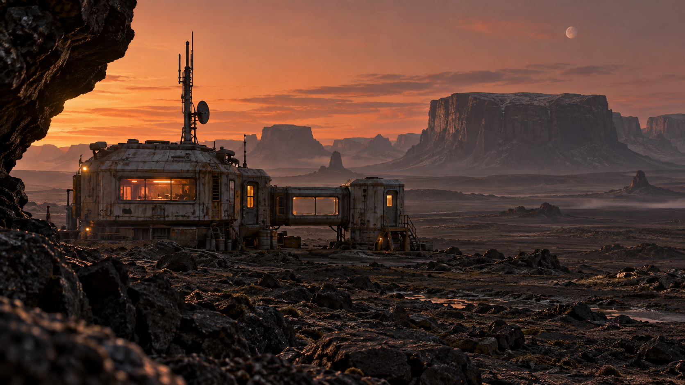

# Initial concept gallery

Nine source images are saved. The planned tenth concept, Night Shift Greenhouse, has no saved image in this folder and is not marked complete. Ringfall Observatory was selected for development.

| Concept | Source |
|---|---|
| 01 Dusk Relay |  |
| 02 Glacier Sanctuary |  |
| 03 The Last Lookout |  |
| 04 Cloudline Control |  |
| 05 Tidal Listening Post |  |
| 06 Ringfall Observatory — selected |  |
| 07 Forest Signal |  |
| 08 Below the Ice |  |
| 09 Basalt Transmission |  |

Original generation briefs: [image-prompts.md](../image-prompts.md). Ringfall variants and refined source are in [../ringfall/](../ringfall/).
