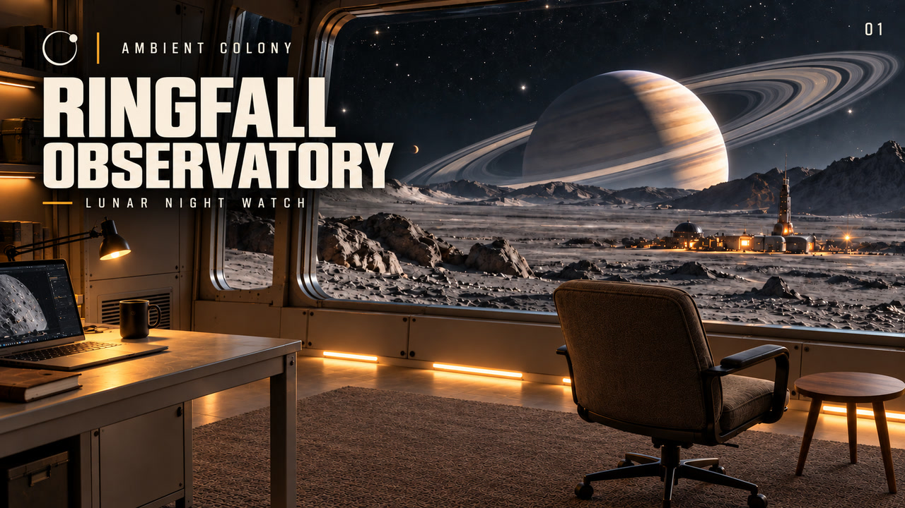
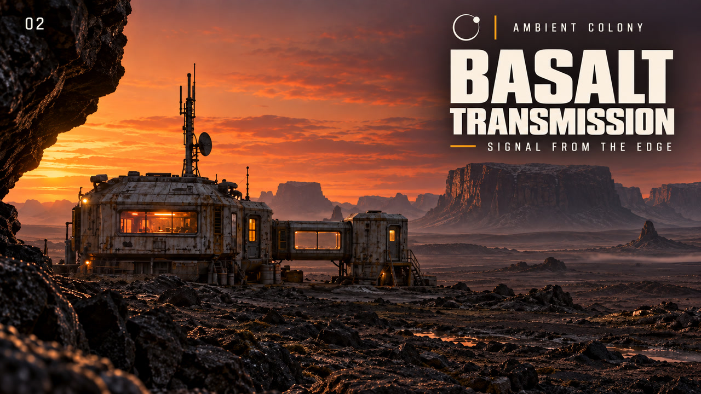
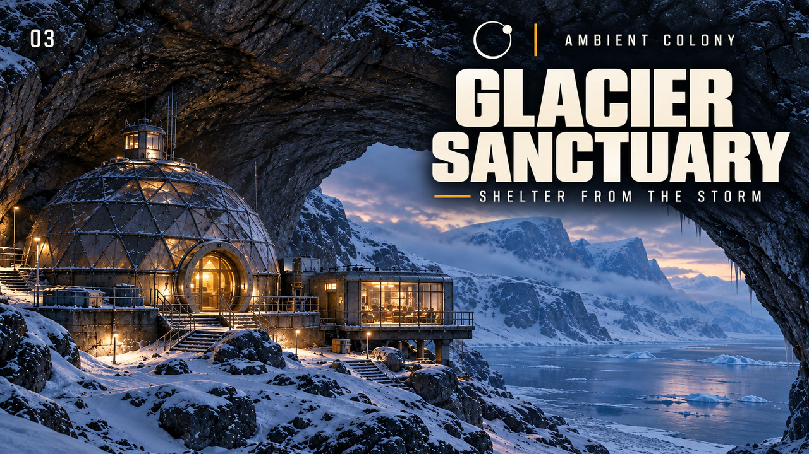

# Ambient Colony - final exports

Three approved scene packages, each with its 4K video loop, approved thumbnail, exact image-generation prompt and provenance manifest.

Each package also includes `description.txt` and `youtube-tags.txt` for copying into YouTube Studio. The search-tag list is comma-separated and below 500 characters per video. Read [DESCRIPTION_STYLE.md](DESCRIPTION_STYLE.md) for the shared voice, approved sign-off and metadata conventions.

| Package | Loop | Thumbnail |
| --- | --- | --- |
| [01 - Ringfall Observatory](01-ringfall-observatory/) | [20 seconds, 4K](01-ringfall-observatory/video-4k.mp4) | [JPEG](01-ringfall-observatory/thumbnail-v1.jpg) |
| [02 - Basalt Transmission](02-basalt-transmission/) | [20 seconds, 4K](02-basalt-transmission/video-4k.mp4) | [JPEG](02-basalt-transmission/thumbnail-v1.jpg) |
| [03 - Glacier Sanctuary](03-glacier-sanctuary/) | [60 seconds, 4K](03-glacier-sanctuary/video-4k.mp4) | [JPEG](03-glacier-sanctuary/thumbnail-v1.jpg) |

All videos are 3840x2160, 30 fps, silent, with upscaled source artwork. These are approved loop masters, not completed long-form music uploads. The video files are byte-identical copies of their original approved production exports; original paths remain available.

Read [THUMBNAIL_STYLE.md](THUMBNAIL_STYLE.md) before producing the next thumbnail. The user approved this set on 2026-09-25: "man they look awesome". PNGs are the generated masters; JPEGs are 1280x720 exports. `catalog.json` indexes the packages.

After cloning with Git LFS installed, run `git lfs pull`. Video paths use exact LFS rules. Compare hashes in each package's `manifest.json`; `remote-backup.json` records independent remote download verification once completed. Drafts, caches and long repeated videos are excluded.

