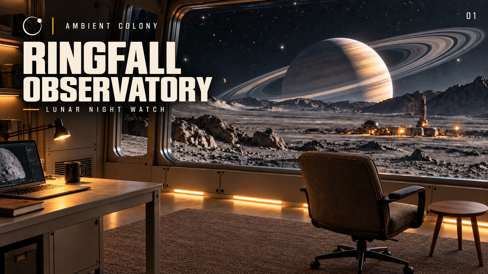
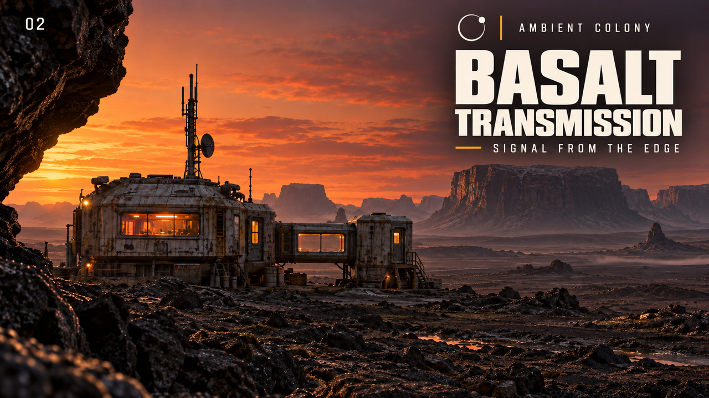
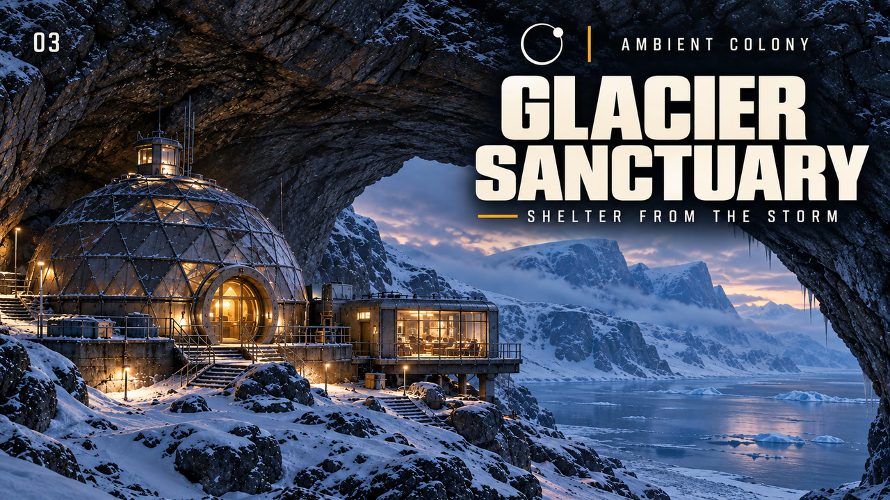

# Ambient Colony - final exports

Three approved video packages (01-03), two artwork/preparation packages (04-05), and accepted clean artwork for 06-07 with new thumbnails pending review. Packages 08-10 now have selected artwork, new thumbnails pending review, metadata and music prompts. Animations for 04-10 have not been produced. Exact image prompts, provenance and current approval scope are recorded per package.

Packages 04-05 also contain revised text-free `artwork-v2-animation.png` candidates with the stronger thumbnail lighting. Their `animation-prep-v1/` folders contain source-coordinate draft masks, scene plans and production briefs; this is preparation, not a rendered animation. Original selected artwork and thumbnails remain unchanged.

All packages 01-10 include `description.txt` and `youtube-tags.txt` for copying into YouTube Studio. The search-tag list is comma-separated and below 500 characters per video. Read [DESCRIPTION_STYLE.md](DESCRIPTION_STYLE.md) for the shared voice, approved sign-off and metadata conventions.

Channel graphic candidate: [ten-second subscribe overlay v1](channel-assets/subscribe-v1/README.md). Green-screen and transparent exports are local review files until accepted; the source renderer, fonts and production notes are portable.

| Package | Loop | Thumbnail |
| --- | --- | --- |
| [01 - Ringfall Observatory](01-ringfall-observatory/) | [20 seconds, 4K](01-ringfall-observatory/video-4k.mp4) | [JPEG](01-ringfall-observatory/thumbnail-v1.jpg) |
| [02 - Basalt Transmission](02-basalt-transmission/) | [20 seconds, 4K](02-basalt-transmission/video-4k.mp4) | [JPEG](02-basalt-transmission/thumbnail-v1.jpg) |
| [03 - Glacier Sanctuary](03-glacier-sanctuary/) | [60 seconds, 4K](03-glacier-sanctuary/video-4k.mp4) | [JPEG](03-glacier-sanctuary/thumbnail-v1.jpg) |
| [04 - Floodplain Keeper](04-floodplain-keeper/) | [Selected artwork](04-floodplain-keeper/artwork-v1.png); no video yet | [JPEG](04-floodplain-keeper/thumbnail-v1.jpg) |
| [05 - Saltline Receiver](05-saltline-receiver/) | [Selected artwork](05-saltline-receiver/artwork-v1.png); no video yet | [JPEG](05-saltline-receiver/thumbnail-v1.jpg) |
| [06 - The Last Cable Station](06-last-cable-station/) | [Final edit v3](06-last-cable-station/artwork-v3-final.png); no video yet | [JPEG](06-last-cable-station/thumbnail-v1.jpg) |
| [07 - Icebound Weather Post](07-icebound-weather-post/) | [Final edit v3](07-icebound-weather-post/artwork-v3-final.png); no video yet | [JPEG](07-icebound-weather-post/thumbnail-v1.jpg) |
| [08 - Rainline Relay](08-rainline-relay/) | [Selected artwork](08-rainline-relay/artwork-v1.png); no video yet | [JPEG](08-rainline-relay/thumbnail-v1.jpg) |
| [09 - The Shoreless Colony](09-offshore-night-office/) | [Selected artwork](09-offshore-night-office/artwork-v1.png); no video yet | [JPEG](09-offshore-night-office/thumbnail-v2.jpg) |
| [10 - Farpoint Station](10-nightward-station/) | [Selected artwork](10-nightward-station/artwork-v3-close-world-leds.png); no video yet | [JPEG](10-nightward-station/thumbnail-v2.jpg) |

All videos are 3840x2160, 30 fps, silent, with upscaled source artwork. These are approved loop masters, not completed long-form music uploads. The video files are byte-identical copies of their original approved production exports; original paths remain available.

Read [THUMBNAIL_STYLE.md](THUMBNAIL_STYLE.md) before producing the next thumbnail. The user approved this set on 2026-09-25: "man they look awesome". PNGs are the generated masters; JPEGs are 1280x720 exports. `catalog.json` indexes the packages.

After cloning with Git LFS installed, run `git lfs pull`. Video paths use exact LFS rules. Compare hashes in each package's `manifest.json`; `remote-backup.json` records independent remote download verification once completed. Drafts, caches and long repeated videos are excluded.

Long upload videos and soundtrack repeats now live in the ignored `../exports/` folder. See [storage policy](../EXPORTS.md) and [local inventory](local-export-inventory.json). The short tracked masters listed above stay here.

Packages 04-10 also contain suggested `youtube-title.txt` and `music/` with one-minute test prompts, longer-piece prompts and manual generation/listening instructions. No soundtracks have been generated for those scenes.
